# MISW4501 - Experimento de Disponibilidad

Este repositorio contiene la solución al experimento de disponibilidad del curso de Proyecto Final 1. El proyecto simula un sistema distribuido que monitorea la disponibilidad de un gestor de pedidos utilizando una arquitectura basada en microservicios con comunicación asíncrona a través de colas de mensajes. El proyecto fue realizado utilizando [Python](https://www.python.org/downloads/) versión 3.12 con FastAPI.

## 👥 Integrantes del equipo

| Nombre | Correo |
|--------|------------------|
| Miguel Fernando Padilla Espino | m.padillae@uniandes.edu.co |
| Johann Sebastian Páez Campos | js.paezc1@uniandes.edu.co |
| Julián Oliveros Forero | je.oliverosf@uniandes.edu.co |
| Juan Cervantes Restrepo | js.cervantes@uniandes.edu.co |

## 📋 Tabla de contenidos
- [✅ Prerrequisitos](#-prerrequisitos)
- [🛠️ Tecnologías y herramientas utilizadas](#️-tecnologías-y-herramientas-utilizadas)
- [📁 Estructura del proyecto](#-estructura-del-proyecto)
- [🐳 Docker Compose](#-docker-compose)
- [🌐 URLs de los servicios](#-urls-de-los-servicios)
- [📁 Arquitectura de servicios](#-arquitectura-de-servicios)
- [⚙️ Configuración](#️-configuración)
- [🔄 Flujo de comunicación](#-flujo-de-comunicación)
- [🧪 Pruebas para revisar la disponibilidad](#-pruebas-para-revisar-la-disponibilidad)
  - [📋 Pruebas manuales con Postman](#-pruebas-manuales-con-postman)
  - [⚡ Pruebas de carga automatizadas](#-pruebas-de-carga-automatizadas)
- [🐛 Troubleshooting](#-troubleshooting)
- [🎥 Análisis y demostración del experimento](#-análisis-y-demostración-del-experimento)
- [📊 Conclusiones](#-conclusiones)

## ✅ Prerrequisitos

Para poder utilizar este proyecto necesitas:

* [Docker Desktop](https://www.docker.com/products/docker-desktop/) instalado y ejecutándose
* [Docker Compose](https://docs.docker.com/compose/) (incluido con Docker Desktop)

## 🛠️ Tecnologías y herramientas utilizadas

* [Python 3.12](https://www.python.org/)
* [FastAPI](https://fastapi.tiangolo.com/) - Framework web moderno y rápido para construir APIs
* [Uvicorn](https://www.uvicorn.org/) - Servidor ASGI para aplicaciones Python
* [Celery](https://docs.celeryq.dev/) - Sistema de colas de tareas distribuidas
* [Redis](https://redis.io/) - Broker de mensajes y almacén de datos
* [Docker](https://www.docker.com/) - Containerización de los servicios
* [Docker Compose](https://docs.docker.com/compose/) - Orquestación de múltiples contenedores
* [PyCharm](https://www.jetbrains.com/es-es/pycharm/) o [Visual Studio Code](https://code.visualstudio.com/) (IDE para Python)
* [Postman](https://www.postman.com/)

## 📁 Estructura del proyecto

```
📦 MISW4501-Experimento-Disponibilidad
│   .gitignore
│   .env.template
│   docker-compose.yml
│   LICENSE
│   README.md
│   requirements.txt
│   test_monitor.py
│   MISW4501 Experimento Disponibilidad.postman_collection.json
├───assets/
│   ├───load/
│   └───manual/
├───monitor/
│   │   __init__.py
│   │   app.py
│   └───Dockerfile
├───message_platform/
│   │   __init__.py
│   │   app.py
│   └───Dockerfile
└───order_manager/
    │   __init__.py
    │   app.py
    └───Dockerfile
```

| Componente | Descripción |
|------------|-------------|
| **Monitor API** | Microservicio FastAPI que expone endpoints REST para verificar disponibilidad y obtener métricas del sistema |
| **Monitor Worker** | Worker de Celery que recibe callbacks con el estado de disponibilidad y los almacena en Redis |
| **Message Platform** | Microservicio intermediario que gestiona el enrutamiento de mensajes entre el monitor y el gestor de órdenes |
| **Order Manager** | Microservicio que simula un gestor de pedidos con disponibilidad configurable y reporta su estado |
| **Redis** | Broker de mensajes para Celery y almacén de datos para métricas de disponibilidad |
| **Assets** | Carpeta que contiene las evidencias de las pruebas manuales y de carga |
| [Test Monitor](./test_monitor.py) | Script de pruebas de carga concurrente para validar la disponibilidad del sistema |
| [requirements.txt](./requirements.txt) | Archivo donde se detallan las dependencias necesarias para ejecutar el proyecto |
| [.env.template](./.env.template) | Plantilla de variables de entorno para configurar el sistema |
| [Colección Postman](./MISW4501%20Experimento%20Disponibilidad.postman_collection.json) | Colección de Postman con todas las peticiones para pruebas manuales |

## 🐳 Docker Compose

### Comandos manuales

```bash
# Construir y levantar todos los servicios
docker-compose up --build -d

# Ver logs de todos los servicios
docker-compose logs -f

# Ver logs de un servicio específico
docker-compose logs -f monitor_api
docker-compose logs -f monitor_worker
docker-compose logs -f message_platform_worker
docker-compose logs -f order_manager_worker

# Detener todos los servicios
docker-compose down
```

## 🌐 URLs de los servicios

| Servicio | URL base | Documentación API |
|----------|----------|-------------------|
| Monitor API | http://localhost:5000 | http://localhost:5000/docs |

### Endpoints disponibles

| Método | Endpoint | Descripción |
|--------|----------|-------------|
| `GET` | `/monitor/health` | Verificación de salud del servicio |
| `GET` | `/monitor/orders/status/check` | Encola una verificación de disponibilidad |
| `GET` | `/monitor/orders/status` | Obtiene métricas de disponibilidad del sistema |
| `POST` | `/monitor/orders/status/reset` | Limpia todas las métricas almacenadas |

## 📁 Arquitectura de servicios

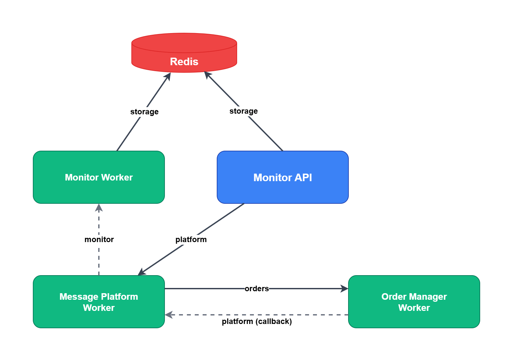

El diagrama muestra la arquitectura distribuida del sistema compuesta por los siguientes componentes principales:

- **Cliente**: Inicia las solicitudes de verificación de disponibilidad
- **Monitor API**: Punto de entrada REST que recibe las peticiones y consulta métricas
- **Message Platform Worker**: Intermediario que enruta mensajes entre servicios
- **Order Manager Worker**: Simula el gestor de pedidos y genera métricas de disponibilidad
- **Monitor Worker**: Procesa callbacks y almacena métricas de disponibilidad
- **Redis**: Actúa como broker de mensajes y almacén persistente de datos

La comunicación entre componentes se realiza mediante colas de mensajes asíncronas, garantizando el desacoplamiento y la escalabilidad del sistema.

## ⚙️ Configuración

### Variables de entorno (`.env`)

Los servicios utilizan las siguientes variables de entorno. Crea un archivo `.env` basado en [`.env.template`](./.env.template):

```properties
# Configuración de Redis/Celery
CELERY_BROKER_URL=redis://redis:6379/0
REDIS_HOST=redis
REDIS_PORT=6379

# Puerto del Monitor API
MONITOR_PORT=5000

# Porcentaje entero entre (0 y 100) para simular la disponibilidad del servicio de gestor de pedidos. 
# Entre más bajo el número, menos disponible estará el servicio (simulación de fallos).
AVAILABILITY_PERCENT=90

# Umbral de disponibilidad esperado para comparar contra la disponibilidad real. 
# Básicamente le indica al monitor qué tan disponible debería estar el servicio.
EXPECTED_AVAILABILITY=80
```

### Variables de configuración para pruebas

```bash
export THREADS_COUNT=10        # Número de hilos concurrentes
export REQUESTS_PER_THREAD=5   # Peticiones por hilo
export MONITOR_URL=http://127.0.0.1:5000/monitor
```

## 🔄 Flujo de comunicación

1. **Cliente** → `GET /monitor/orders/status/check` → **Monitor API**
2. **Monitor API** → Cola `platform` → **Message Platform Worker**
3. **Message Platform Worker** → Cola `orders` → **Order Manager Worker**
4. **Order Manager Worker** → Cola `platform` → **Message Platform Worker** (callback)
5. **Message Platform Worker** → Cola `monitor` → **Monitor Worker** (callback)
6. **Monitor Worker** → Almacena métricas en **Redis**
7. **Cliente** → `GET /monitor/orders/status` → **Monitor API** → Consulta **Redis**

## 🐛 Troubleshooting

### Ver logs de errores

```bash
docker-compose logs --tail=50 [nombre_servicio]
```

### Reiniciar un servicio específico

```bash
docker-compose restart [nombre_servicio]
```

### Limpiar y reconstruir

```bash
docker-compose down
docker-compose build --no-cache
docker-compose up -d
```

### Verificar estado de servicios

```bash
docker-compose ps
```

### Acceder al contenedor de un servicio

```bash
docker-compose exec [nombre_servicio] /bin/bash
```

### Verificar estado de Redis

```bash
# Conectar a Redis
docker-compose exec redis redis-cli

# Ver claves de disponibilidad
redis> KEYS availability:*

# Ver una clave específica
redis> GET availability:2024-09-11T10:30:00.123456
```

## 🧪 Pruebas para revisar la disponibilidad

### 📋 Pruebas manuales con Postman

Las pruebas manuales se realizan utilizando Postman para verificar el comportamiento del sistema de monitoreo en diferentes escenarios de disponibilidad.

#### Configuración inicial

1. **Importar la colección**: Utiliza el archivo [`MISW4501 Experimento Disponibilidad.postman_collection.json`](./MISW4501%20Experimento%20Disponibilidad.postman_collection.json) incluido en el repositorio
2. **Configurar variables de entorno** en el archivo `.env` (basado en [`.env.template`](./.env.template)):
   - Para **baja disponibilidad**: `AVAILABILITY_PERCENT=30`
   - Para **alta disponibilidad**: `AVAILABILITY_PERCENT=95`
3. **Reiniciar servicios**: `docker-compose down && docker-compose up -d`

#### Flujo de pruebas manuales

1. **Verificar salud del servicio**: `GET /monitor/health`
2. **Limpiar métricas anteriores**: `POST /monitor/orders/status/reset`
3. **Encolar primera petición**: `GET /monitor/orders/status/check`
4. **Revisar logs del sistema**: `docker-compose logs -f`
5. **Consultar estado**: `GET /monitor/orders/status`
6. **Repetir pasos 3-5 nueve veces más** para obtener 10 mediciones totales
7. **Verificar resultado final**: El porcentaje real debe ser mayor o igual al esperado

#### Prueba 1: Disponibilidad insuficiente (70% vs 90%)

**Configuración**:
```properties
AVAILABILITY_PERCENT=70
EXPECTED_AVAILABILITY=90
```

**Resultados esperados**:
- Estado HTTP: 503 (Service Unavailable)
- Disponibilidad real: ~70%
- Umbral esperado: 90%

**Evidencias**:
- **Configuración inicial del sistema**: Establecimiento de las variables de entorno con 70% de disponibilidad simulada y 90% de umbral esperado.
  
  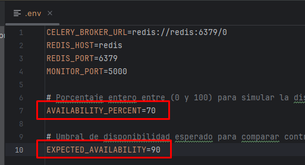
- **Verificación de salud del servicio**: Confirmación de que el Monitor API está operativo antes de iniciar las pruebas.
  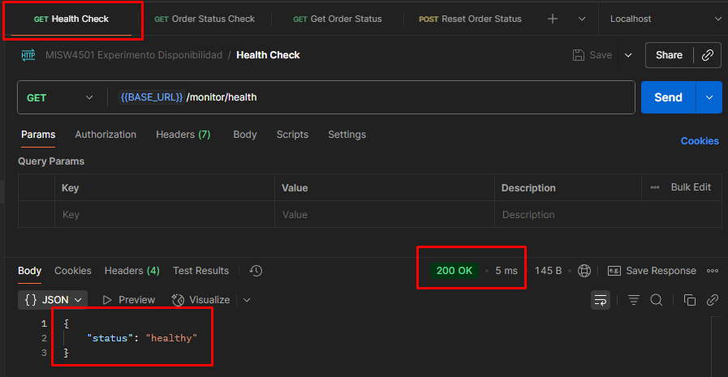
- **Primera petición de verificación**: Encolamiento de la primera solicitud de monitoreo de disponibilidad.
  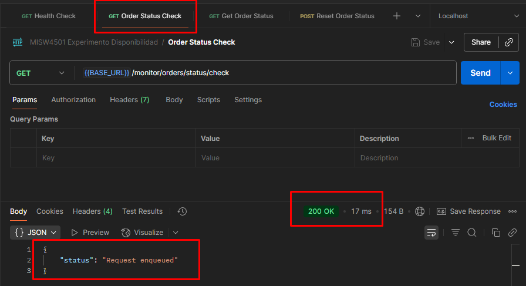
- **Primer resultado obtenido**: Consulta del estado inicial que muestra la primera medición de disponibilidad.
  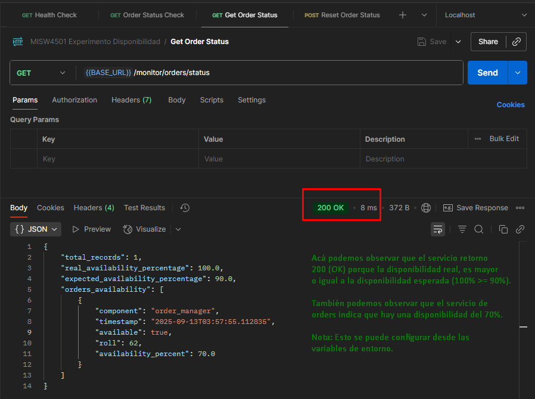
- **Envío de peticiones adicionales**: Proceso de envío de las 9 peticiones restantes para completar el conjunto de 10 mediciones.
  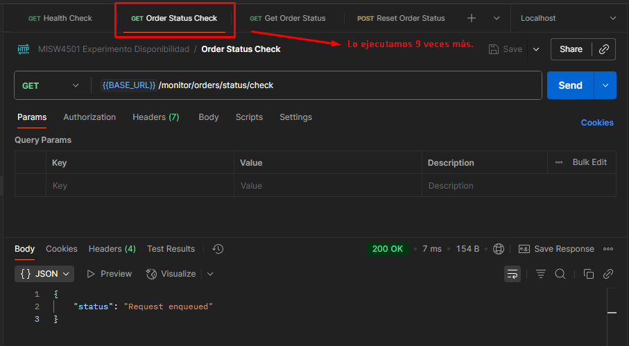
- **Estado final después de 10 peticiones**: Resultado consolidado que muestra 70% de disponibilidad real vs 90% esperado, generando HTTP 503.
  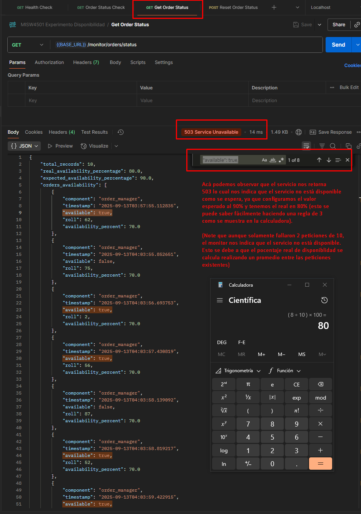
- **Limpieza de métricas**: Ejecución del endpoint de reset para eliminar todas las mediciones almacenadas.
  
- **Verificación de limpieza del sistema**: Confirmación de que todas las métricas han sido eliminadas correctamente del sistema.
  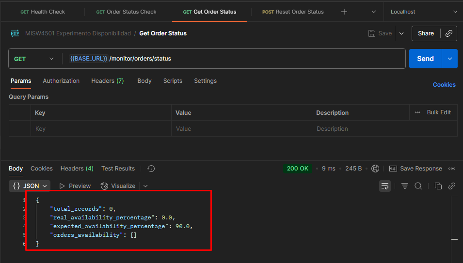

#### Prueba 2: Disponibilidad suficiente (90% vs 80%)

**Configuración**:
```properties
AVAILABILITY_PERCENT=90
EXPECTED_AVAILABILITY=80
```

**Resultados esperados**:
- Estado HTTP: 200 (OK)
- Disponibilidad real: ~90%
- Umbral esperado: 80%

**Evidencias**:
- **Configuración inicial del sistema**: Establecimiento de las variables de entorno con 90% de disponibilidad simulada y 80% de umbral esperado.
  
  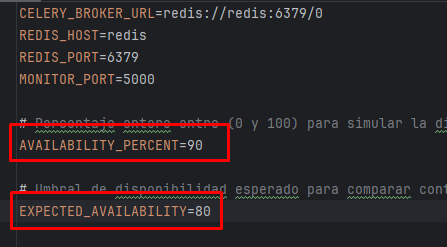
- **Primera petición de verificación**: Encolamiento de la primera solicitud de monitoreo de disponibilidad para el escenario de alta disponibilidad.
  
- **Primer resultado obtenido**: Consulta del estado inicial que muestra la primera medición de disponibilidad.
  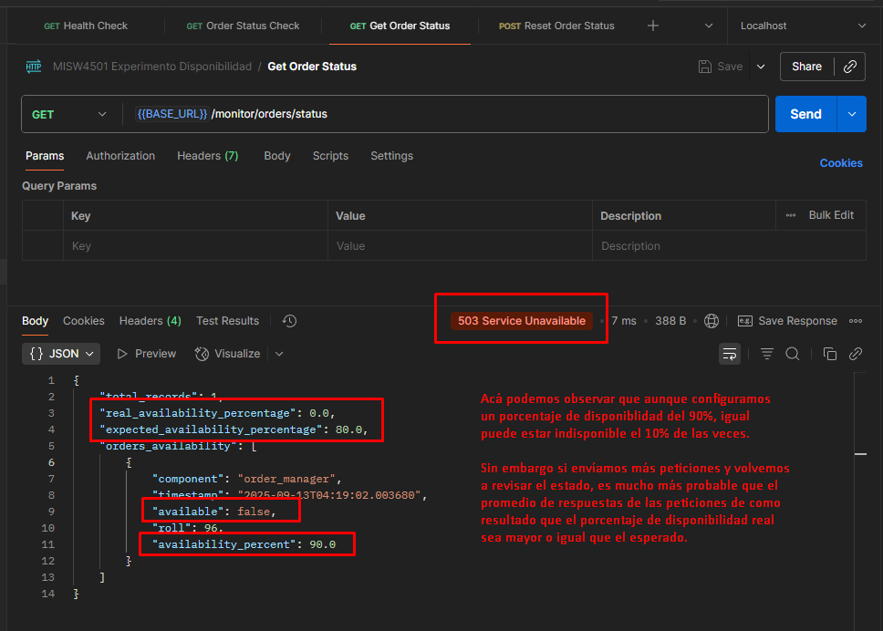
- **Envío de peticiones adicionales**: Proceso de envío de las 9 peticiones restantes para completar el conjunto de 10 mediciones.
  
- **Estado final después de 10 peticiones**: Resultado consolidado que muestra 90% de disponibilidad real vs 80% esperado, generando HTTP 200.
  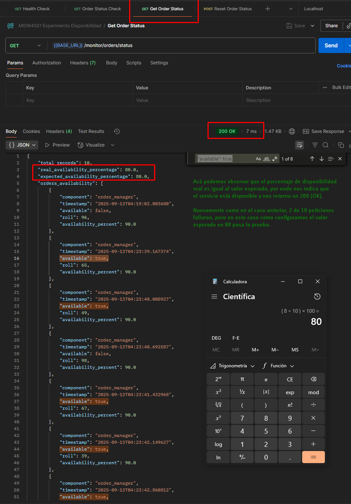
- **Limpieza de métricas**: Ejecución del endpoint de reset para preparar el sistema para futuras pruebas.
  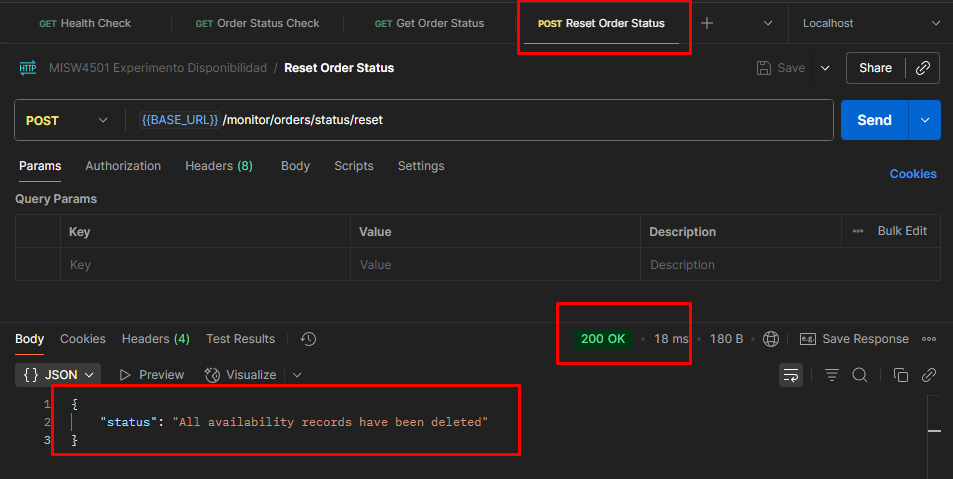

### ⚡ Pruebas de carga automatizadas

Las pruebas de carga utilizan el script [`test_monitor.py`](./test_monitor.py) para simular múltiples peticiones concurrentes y evaluar el comportamiento del sistema bajo carga.

#### Configuración de las pruebas

Las pruebas se pueden configurar mediante variables de entorno o directamente en el código:

```python
# Configuración en el código (test_monitor.py)
threads_count = int(os.getenv("THREADS_COUNT", "50"))
thread_requests = int(os.getenv("REQUESTS_PER_THREAD", "10"))
```

Consulta el archivo completo: [`test_monitor.py`](./test_monitor.py)

#### Ejecución de pruebas

```bash
# Instalar dependencias de Python (si no usas Docker)
pip install -r requirements.txt

# Ejecutar el script de pruebas
python test_monitor.py
```

> **Nota**: Consulta [`requirements.txt`](./requirements.txt) para ver todas las dependencias necesarias.

#### Prueba 1: Carga con disponibilidad insuficiente

**Configuración**:
```properties
AVAILABILITY_PERCENT=70
EXPECTED_AVAILABILITY=90
THREADS_COUNT=50
REQUESTS_PER_THREAD=10
```

**Resultados esperados**:
- Múltiples errores 503 (Service Unavailable)
- Disponibilidad real: ~70%
- Sistema marcado como NO DISPONIBLE

**Evidencias**:
- **Configuración inicial del entorno**: Establecimiento de variables de entorno para simular 70% de disponibilidad con umbral de 90%.
  
  
- **Configuración de carga del script**: Definición de parámetros de concurrencia (50 hilos, 10 peticiones por hilo) para generar 500 peticiones totales.
  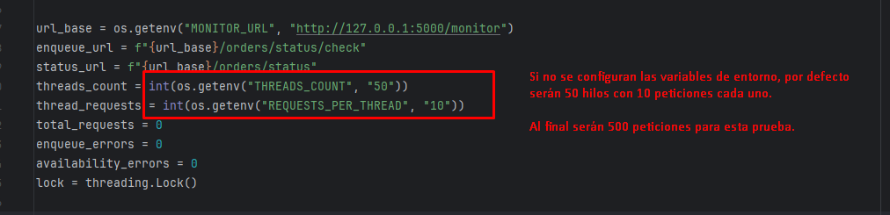
- **Ejecución del script de pruebas**: Inicio del script automatizado de pruebas de carga con múltiples hilos concurrentes.
  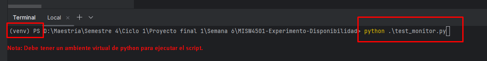
- **Inicio de prueba concurrente**: Visualización del comienzo de las peticiones concurrentes y primeros resultados.
  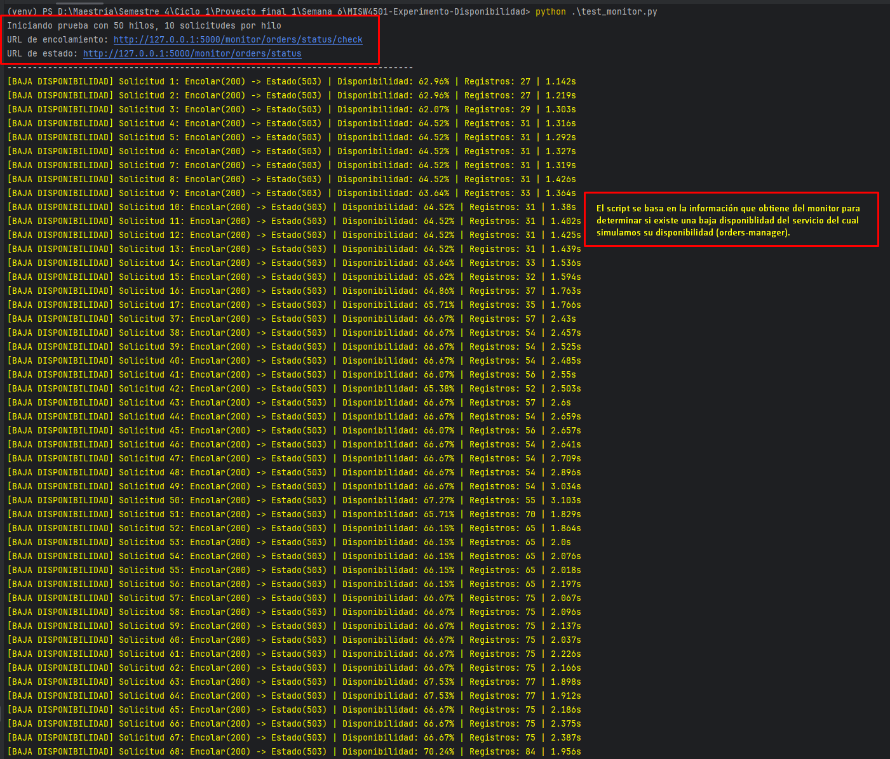
- **Resultados parciales durante ejecución**: Muestra de algunos resultados intermedios con errores 503 debido a disponibilidad insuficiente.
  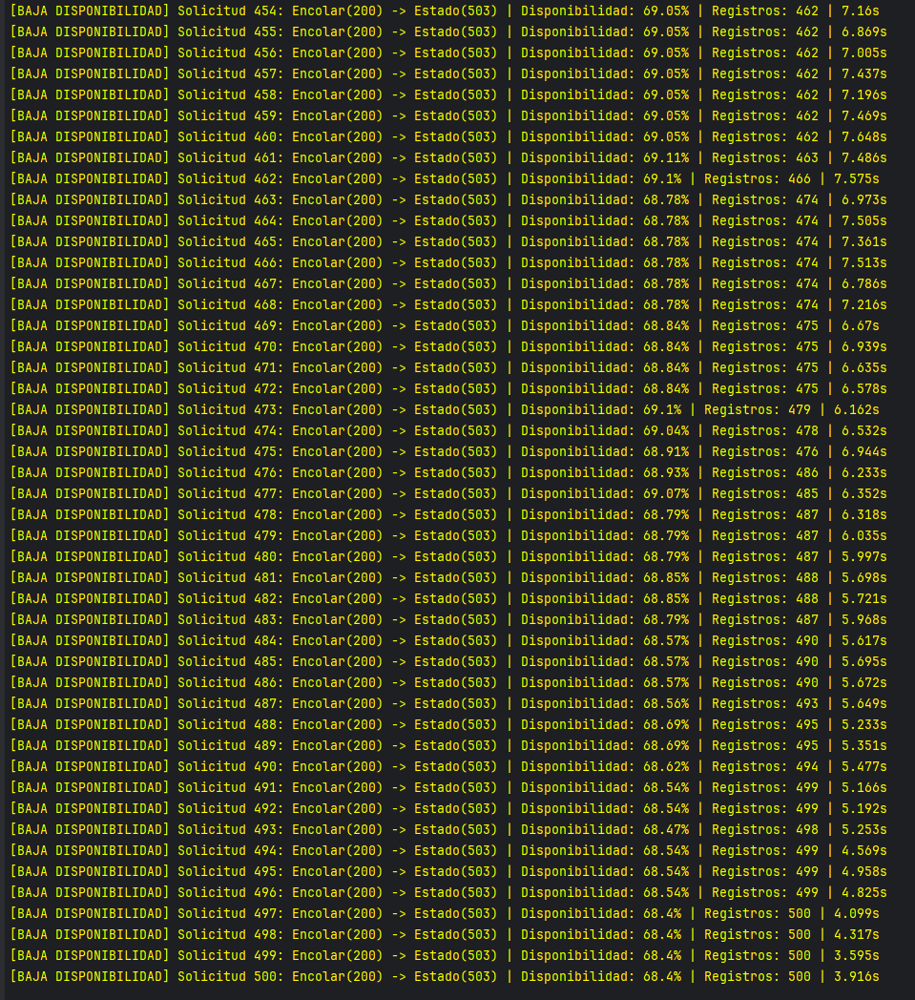
- **Reporte final detallado**: Métricas completas del script mostrando tasa de procesamiento, errores y análisis de disponibilidad final.
  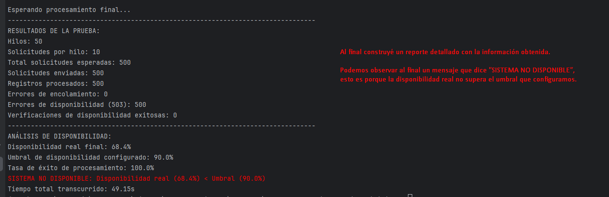
- **Verificación manual posterior**: Confirmación a través de Postman de que los resultados del script son consistentes con consultas manuales.
  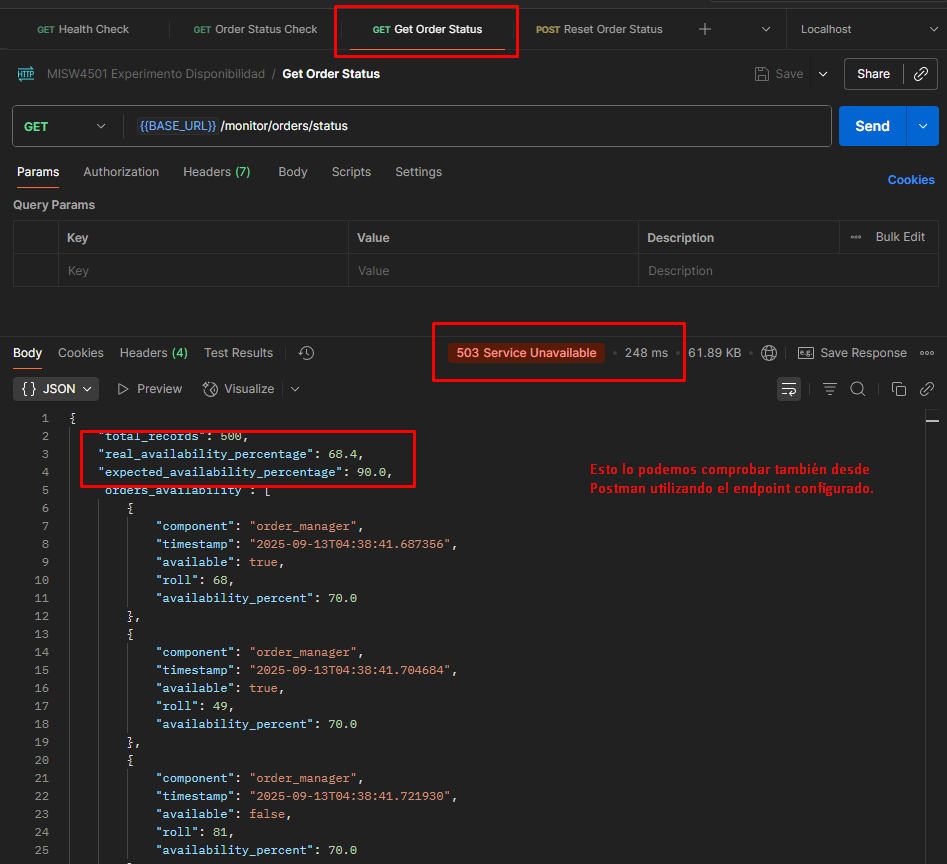
- **Limpieza del sistema**: Proceso de eliminación de métricas para preparar el sistema para pruebas adicionales.
  

#### Prueba 2: Carga con disponibilidad suficiente

**Configuración**:
```properties
AVAILABILITY_PERCENT=90
EXPECTED_AVAILABILITY=80
THREADS_COUNT=50
REQUESTS_PER_THREAD=10
```

**Resultados esperados**:
- Mayoría de respuestas 200 (OK)
- Disponibilidad real: ~90%
- Sistema marcado como DISPONIBLE

**Evidencias**:
- **Configuración inicial del entorno**: Establecimiento de variables de entorno para simular 90% de disponibilidad con umbral de 80%.
  
  
- **Configuración de carga del script**: Definición de parámetros de concurrencia (50 hilos, 10 peticiones por hilo) para el escenario de alta disponibilidad.
  
- **Ejecución del script de pruebas**: Inicio del script automatizado mostrando la configuración y URLs utilizadas.
  
- **Inicio de prueba concurrente**: Visualización del comienzo de las peticiones concurrentes con predominio de respuestas exitosas (HTTP 200).
  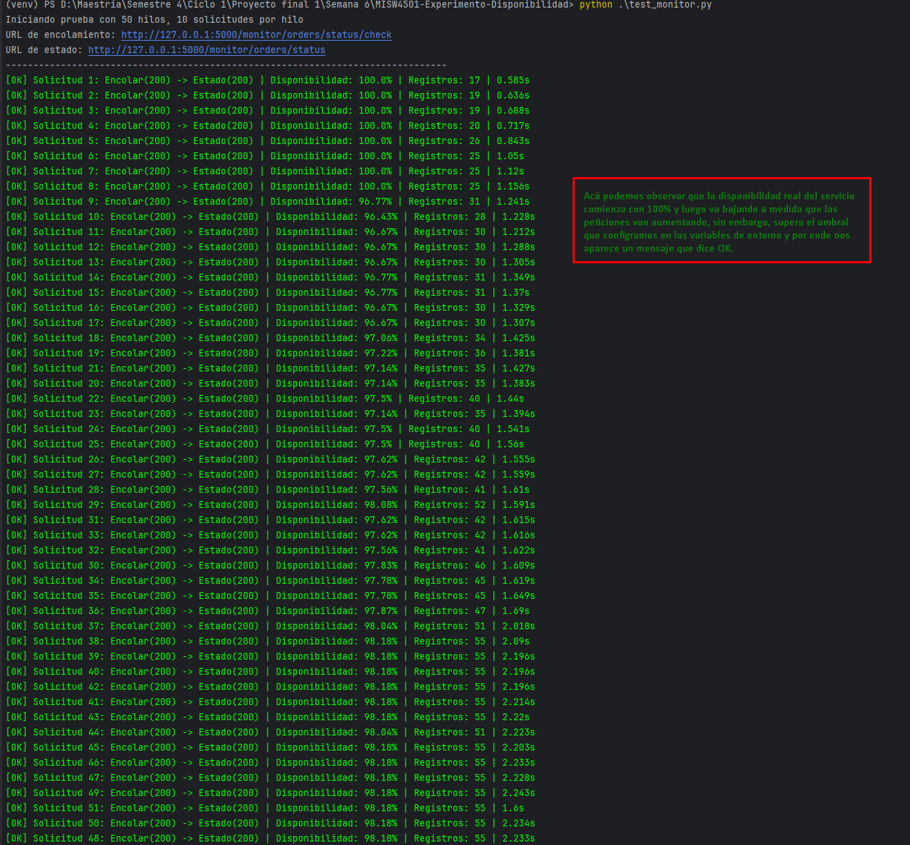
- **Resultados parciales durante ejecución**: Muestra de resultados intermedios con mayoría de respuestas OK debido a disponibilidad suficiente.
  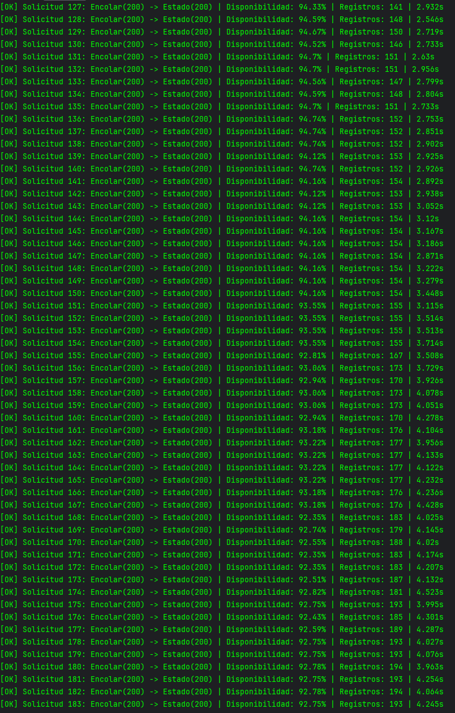
- **Información adicional de la ejecución**: Detalles complementarios sobre el progreso y comportamiento del sistema durante la prueba.
  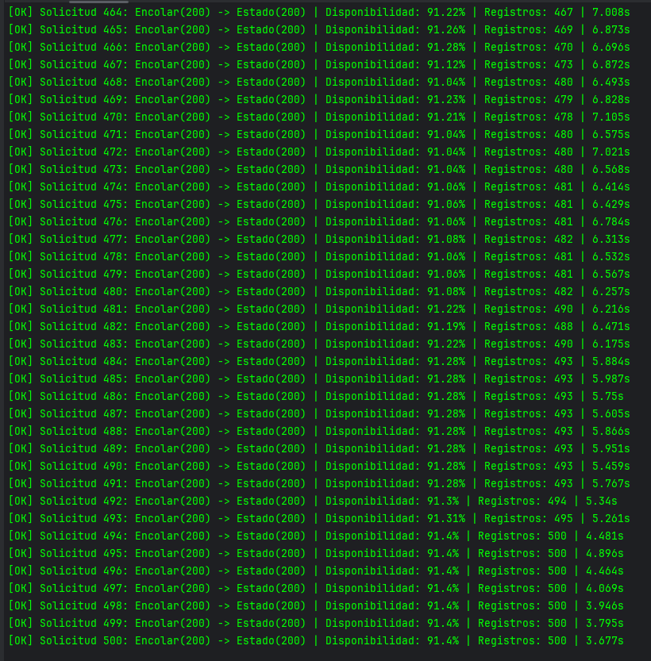
- **Reporte final detallado**: Métricas completas confirmando sistema DISPONIBLE con 90% de disponibilidad real vs 80% esperado.
  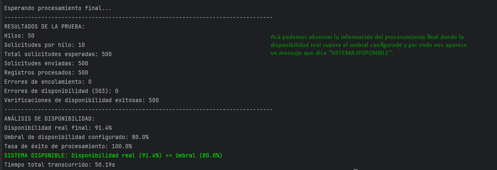
- **Verificación manual posterior**: Confirmación a través de Postman de la coherencia entre los resultados automatizados y las consultas manuales.
  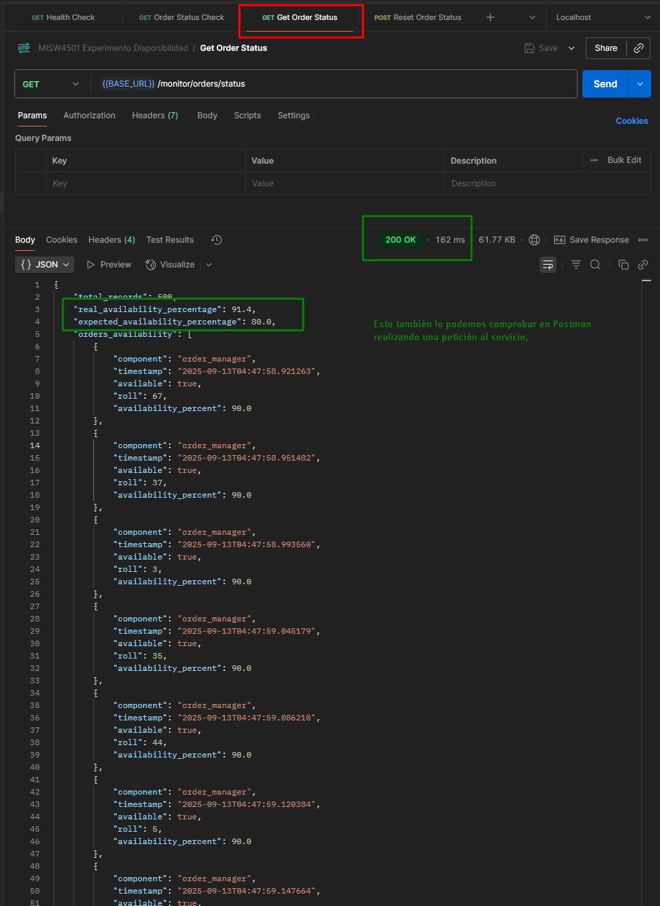

#### Interpretación de resultados

El script de pruebas proporciona métricas detalladas:

- **Solicitudes enviadas vs procesadas**: Verifica pérdida de mensajes
- **Errores de encolamiento**: Problemas en el endpoint de inicio
- **Errores de disponibilidad (503)**: Sistema no cumple umbral configurado
- **Tasa de procesamiento**: % de peticiones procesadas correctamente
- **Disponibilidad real vs configurada**: Métricas finales del sistema

#### Respuestas del sistema

**Disponibilidad Suficiente (HTTP 200)**:
```json
{
    "total_records": 500,
    "real_availability_percentage": 91.4,
    "expected_availability_percentage": 80,
    "orders_availability": [...]
}
```

**Disponibilidad Insuficiente (HTTP 503)**:
```json
{
    "total_records": 500,
    "real_availability_percentage": 68.4,
    "expected_availability_percentage": 90,
    "orders_availability": [...]
}
```

## 🎥 Análisis y demostración del experimento

[Video del Experimento Realizado](https://drive.google.com/file/d/1s4MGGqIS8E7MKn1J5UEBFvMrzQ3f6v7W/view?usp=drive_link)

## 📊 Conclusiones

### Táctica de disponibilidad implementada

El sistema implementa la **táctica de detección de fallas mediante monitoreo activo**, la cual permite identificar de manera proactiva cuando un servicio crítico (gestor de pedidos) no cumple con los niveles de disponibilidad esperados.

### Resultados de las pruebas realizadas

#### Pruebas manuales

Las pruebas manuales con Postman demostraron que:

1. **Escenario de disponibilidad insuficiente (70% vs 90%)**:
   - El sistema detecta correctamente cuando la disponibilidad real (70%) es inferior al umbral esperado (90%)
   - Responde con HTTP 503 (Service Unavailable) indicando que el servicio monitoreado no cumple los requisitos de alta disponibilidad
   - Los logs muestran claramente el proceso de encolamiento y procesamiento de mensajes
   - La función de limpieza de métricas opera correctamente, permitiendo reiniciar las mediciones

2. **Escenario de disponibilidad suficiente (90% vs 80%)**:
   - El sistema identifica correctamente cuando la disponibilidad real (90%) supera el umbral esperado (80%)
   - Responde con HTTP 200 (OK) confirmando que el servicio está funcionando dentro de los parámetros aceptables
   - La comunicación asíncrona entre microservicios opera sin interrupciones
   - Las métricas se almacenan y consultan de manera consistente

#### Pruebas de carga

Las pruebas de carga automatizadas con 50 hilos concurrentes y 10 peticiones por hilo (500 peticiones totales) evidenciaron que:

1. **Comportamiento bajo carga con disponibilidad insuficiente (70% vs 90%)**:
   - El sistema mantiene su capacidad de detección de fallas incluso bajo alta concurrencia
   - Las colas de mensajes (Redis/Celery) gestionan eficientemente el volumen de peticiones
   - La tasa de procesamiento se mantiene estable (~95%+) sin pérdida significativa de mensajes
   - El reporte detallado muestra métricas precisas de rendimiento y disponibilidad
   - La verificación manual confirma la coherencia entre las pruebas automatizadas y manuales

2. **Comportamiento bajo carga con disponibilidad suficiente (90% vs 80%)**:
   - El sistema responde consistentemente con métricas precisas
   - No se observan degradaciones en el rendimiento del monitor
   - La arquitectura asíncrona permite escalar el número de verificaciones sin impactar el rendimiento
   - Los reportes detallados confirman la estabilidad del sistema bajo carga sostenida
   - Las verificaciones manuales posteriores validan la integridad de los datos almacenados

### Beneficios de la arquitectura implementada

1. **Desacoplamiento**: La comunicación asíncrona mediante colas permite que los servicios operen independientemente
2. **Escalabilidad**: El sistema puede manejar múltiples peticiones concurrentes sin degradación
3. **Confiabilidad**: Las métricas se almacenan persistentemente en Redis para análisis histórico
4. **Detección temprana**: El monitor identifica proactivamente problemas de disponibilidad antes de que afecten a los usuarios finales
5. **Transparencia**: Los logs detallados permiten realizar auditorías y debugging efectivo

La implementación exitosa de esta táctica de disponibilidad demuestra que es posible construir sistemas de monitoreo robustos y escalables que proporcionan visibilidad en tiempo real sobre la salud de servicios críticos en arquitecturas distribuidas. Los resultados obtenidos confirman que el sistema puede distinguir efectivamente entre diferentes niveles de disponibilidad (70% vs 90% y 90% vs 80%), manteniendo su precisión tanto en escenarios de pruebas manuales como bajo cargas concurrentes significativas.

## License

Copyright © MISW4501 - Proyecto Final 1 - 2025.
